# Real-world Anomaly Detection in Surveillance Videos


Paper link : [LINK](https://arxiv.org/pdf/1801.04264.pdf)


### Abstract 
감시카메라는 현실세계에서 이상치를 탐색하는데 있어서 중요한 역할을 수행함
그래서 논문의 저자는 Normal, Anomalous video들을 이용해서 Anomalies를 학습할 수 있는 방식을 제안함
- 기존의 방식들은 Training Video들에 대해서 Annotation들을 수행헀는데 이는 엄청난 시간낭비를 유도한다는 담점이 존재함
- 해당 논문의 저자는 Weakly labeled training video를 이용하여 Multiple Instance Ranking framework을 통해서 Anomaly를 학습하는 방식을 제안함

- ```Normal, Anomaly video들을 Bags라는 개념을 도입하여 생각하고, video segments들을 Multiple INstance Learning의 Instances라고 함```

- ```Deep Anomaly Ranking Model을 통해서 Anomalous video segments에 대해서 높은 anomaly Score를 부여하도록 예측하는 학습방식을 채택함```


### Introduction
- MIL(Multiple Instance Learning)을 통해서 적은 labeled dataset에 대해서 해결책을 제시. Sparsity & smoothness constraints에 대해서 MIL ranking loss를 제안함 

- 13가지의 서로다른 이상치가 존재하는 1900개의 real-world의 감시카메라와 정상활동을 포착한 감시카메라를 Dataset으로 가짐

- 실험결과를 통해서 새로운 데이터셋을 통해서 논문의 저자가 구현한 모델이 SOTA임을 증명


```
Ranking이란
Machine Learning 분야의 연구분야중 하나로, Individual scores들 대신에 item들의 상대적인 score를 향상시키는 기법에 초점을 맞춘다.
기존의 다양한 방식들은 막대한양의 Positive, Negative sample이 필요했지만,
해당 논문의 저자가 수행하는 방식에서는 Positive Sample의 양이 압도적으로 적음

이를 위해서 Ranking Framework에서 Normal & anomalous data를 사용하여 Anomaly Detection을 regression problem으로 Fomulate 

정확한 segment-evel labels들을 얻는 어려움을 완화시키기 위해서 video-level에서 Annotation...

예를들면 하나의 비디오 내에 이상치가 있다 없다의 유무만 Annotation..
비디오 특정 부분마다 Annotation을 하지 않음.
```


## Proposed Anomaly Detection Method
제안된 방식들은 Training 시에 segments들의 개수를 고정시켜 입력데이터로 넣는다.

모델의 구조를 살펴보면 다음과 같다.
<p>
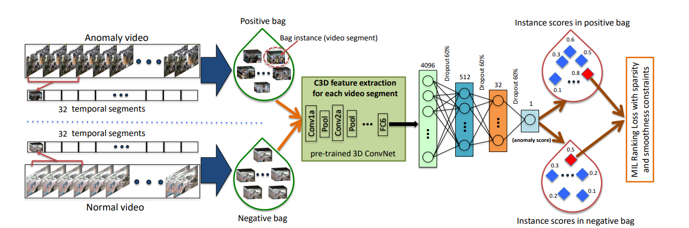
</p>
- Positive & Negative Sample들을 둘 다 사용하여, 모델은  MIL ranking Loss를 이용하여 모델을 Update한다.

<p>
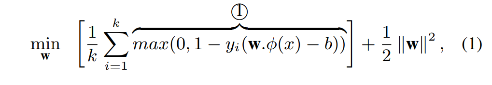
</p>

다음 식은 SVM을 이용하여 Supervised classification 문제를 해결하는 방식이다.
Negative, Positive Sample들을 모두이용하여 Optimization하는 Function이다.

위의 left side의 식은 hinge loss로 $y_i$는 각각의 sample들에 대한 label
- $\phi(x)$ : image patch or video segment에 대한 Feature Representation
- $b,k$ : bias ,total number of training examples
- $w$ : classifier to be learned 

여기서 supervised anomaly detection의 관점으로 보면,
classifier 는 비디오 내에 있는 각각의 segment들에 대해서 temporal annotation이 필요로 한다.
하지만 비디오마다 temporal annotations을 얻는다는것은 시간 낭비와 노동력이 많이 든다는 한계점이 존재한다.

이를 위해서 MIL은 temporal annotiation의 문제를 완화하려고 함.
MIL에서는 비디오 내부에 anomalous events들의 precise temporal locations이 알려지지 않는다. 대신 비디오내에 이상치가 존재한다 라는 label만을 필요로함.

- Positive Label : 해당 비디오내에 Anomaly가 있다.
- Negative Label : 해당 비디오내에 Anomaly가 없다.

이 두개의 개념을 가지고 MIL을 수행한다.
- $\mathcal{B}_a$ : positive video 를 담은 bags
    - ($p^1,p^2,...,p^m$) : m은 bag내에 instance의 개수
- $\mathcal{B}_n$ : negative video 를 담은 bags
    - ($n^1,n^2,...,n^m$) : n은 bag내에 instance의 개수

negative bag 내에는 어떠한 이상치도 존재하지 않음.
Instance-level label의 정확한 정보는 없지만 이러한 방식으로 Object Function을 Optimization이 가능하다.

<p>
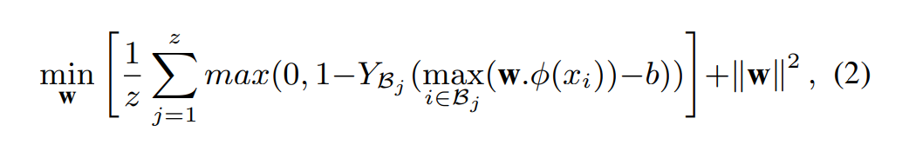
</p>

- $\mathcal{Y_{B_j}}$ : bag-level label
- $z$ : # of bags
- 그 외에 식은 (1)식과 같다.


### Deep MIL Ranking Model
- Anomaly Detection 문제를 regression Problem 관점으로 해결하자.
- 우리가 원하는것은 anomaly video segment들이 nomral video segment들에 비해서 훨씬 큰 값을 가지게 되는것을 원함.
<p>
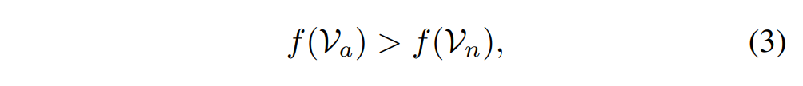
</p>

- $\mathcal{V}_a$ , $\mathcal{V}_b$ : anomalous and normal video segments
- $f(\mathcal{V}_a)$ , $f(\mathcal{V}_b)$ : corresponding predicted scores.

근데 위의 식의 경우는 segment-level annotation들에 대해서 annotate여야하는데, 해당 방식은 우리의 Data Sampling에 적용을 할 수 없다.
따라서 식을 조금 변형 시켜서 각각의 bag내에 모든 video segment에 대해 $\max$를 추출하여 계산하는 방식으로 한다.
<p>
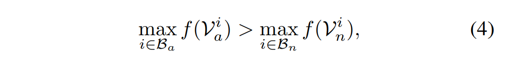
</p>

- Positive Sample에서 가장 높은 score를 가졌다는것은 결과적으로 True Positive Instance일 것이라는 가정을 한다.
- 또한 Negative Sample에서 가장 높은 Score를 가졌다는것은 Anomaly 처럼 보이지만 Anomaly가 아닌 헷갈리는 데이터로 간주한다. 이러한 Instance는 Hard Instance로 여기는데 False Alarm을 야기하는 데이터이기 때무.

위의 방식을 통해서 다음과 같은 hinge-loss fomulation에서 Ranking loss를 다음과 같이 표현할 수 있다.

<p>
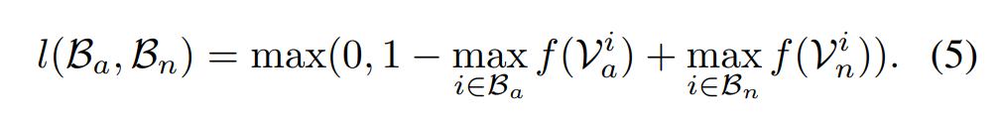
</p>

- 근데 위의 방식을 따르면 결과적으로는 anomalous video의 temporal structure를 배제하는 하는데 다음과 같다.
    - real-world에서는 anomaly는 순식간에 지나감
    - anomalous bag에 있는 Instance score는 sparse

- 비디오는 segments들의 sequence이기 때문에, anomaly score는 video segment사이에 smoothly하게 변화해야함.

- ```이러한 점들로 인해서, 인접한 두개의 temporal video segments들에 대해서 score의 차이를 최소화 해야한다는 것```
- Sparsity와 smoothness constraint들을 사용함으로써 loss Function은 다음과 같다.

<p>
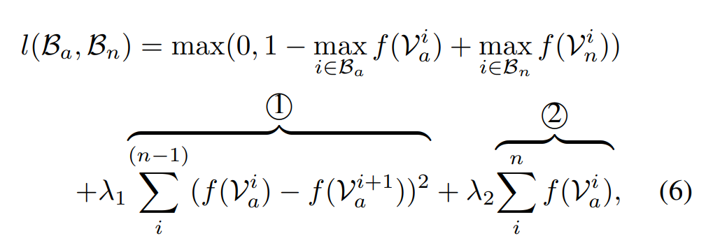
</p>

- 1번은 temporal smoothness term
- 2번은 sparsity term을 나타낸다.

위의 loss Function을 통해서 Pos,Neg bags에 maximum scored video segment로 부터 Back-Propagation을 진행함
<p>
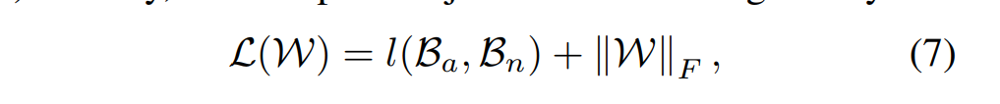
</p>


## Dataset Description

<p>
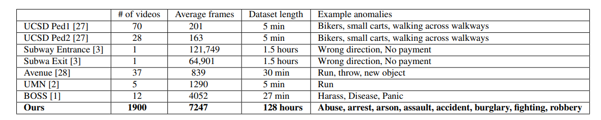
</p>

<p>
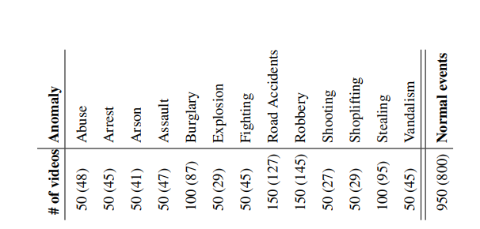
</p>


## Results

<p>
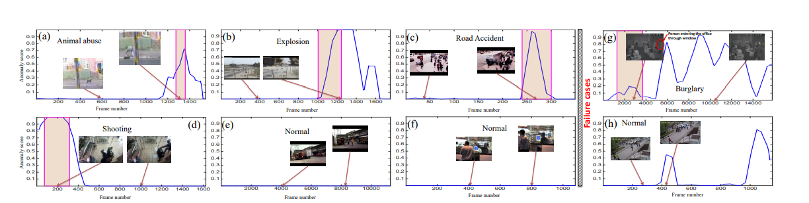
</p>
<p>
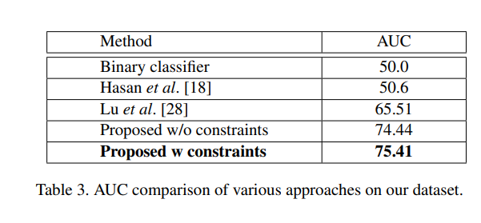
</p>
